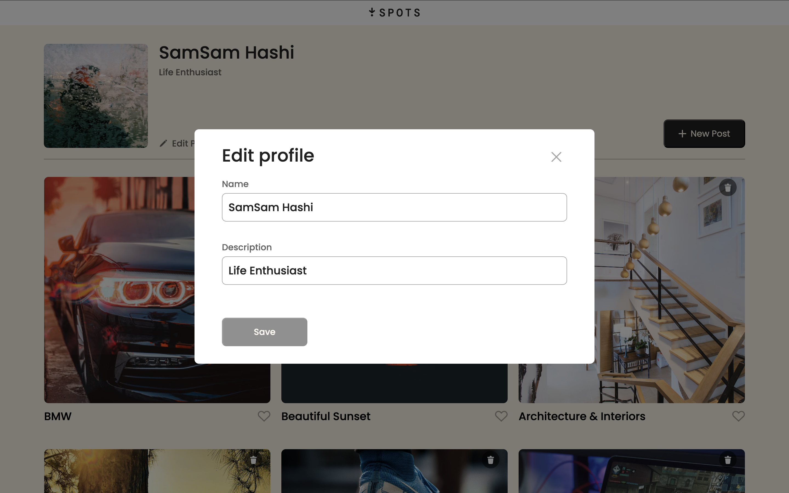

# Spots

The project, named "Spots," is an interactive profile app that allows users to create and customize their user profiles. Built with HTML, CSS, and JavaScript, it offers a sleek, responsive interface inspired by a Figma design brief.

## Table of Contents

- [Project Description](#project-description)
- [Project Features](#project-features)
- [Plan on Improving the Project](#plan-for-improving-the-project)
- [Screenshots](#screenshots)
- [Live Demo](#live-demo)
- [Project Demo 1](#project-demo-1)
- [Project Demo 2](#project-demo-2)
- [Deployment Instructions](#deployment-instructions)
- [System Requirements](#system-requirements)

## Project Description

This project was completed as part of the Software Engineering program at TripleTen. It was developed using HTML and CSS, following a design brief from Figma. Spots allow users to add, delete, like cards, and edit their profiles. It's a great app for anyone who wants to design their profile.

### Project Features

- Figma-based UX/UI
- HTML
- CSS
- JavaScript
- Responsive Design
- Flexbox layout
- Flat BEM File Structure
- Media queries for adaptability

This design is responsive, making it user-friendly on different devices.

## Plan for improving the project

- Fix the lack of personalization by implementing a theme switcher to achieve night/day mode. allowing users to toggle between day and night modes for enhanced visual appearance and improved accessibility
- Enhance customization options by adding the ability for users to select from a list of different background colors, giving users more control to personalize their profile section

## Screenshots

## Profile


## Edit Mode



## View Mode


## Delete Mode


## Add Mode


## Live Demo

- This webpage is deployed to GitHub Pages:

Deployment link: https://Samjamhas10.github.io/se_project_spots

## Project Demo 1

- A walkthrough of the original version of the spots project, focusing on the coding process and programming experience.

https://www.loom.com/share/abb517ce18e94cc28e7db3f33cb54c29

## Project Demo 2

- This updated version showcases the newest features and personalization options

## Deployment Instructions

To run the project locally:

1. Clone the repository:

```bash
  git clone https://github.com/samjamhas10/se_project_spots.git
```

2. Navigate to the project directory:

cd se_project_spots

3. Open the index.html file in your browser

## System Requirements

- Node.js: 14.0.0 or higher (currently tested with v23.11.0)
- npm: 6.0.0 or higher (currently tested with v10.9.2)
- Modern web browser with ES5 support
